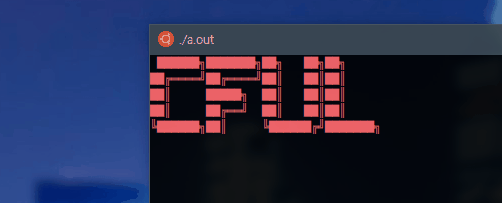
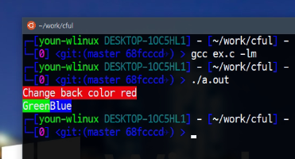

# CFUL


C언어를 사용하여 화려한 색깔을 콘솔에 출력합니다.



## 언어
  - [한국어](/README.ko.md)
  - [English](/README.md)


## CFUL이 무엇인가요?
CFUL은 다채로운 색깔을 출력할 수 있도록 해주는 함수들을 포함하고 있습니다.
하지만, CFUL은 불필요한 기능(라이브러리의 목적과 다른 기능)들도 다수 포함하고 있습니다.

## 지원
  - Linux
  - Windows 10
  - MacOS

만약 OS 가 트루컬러를 지원하지 않는다면, 이 버전을 사용하지 마세요.


## 어떻게 사용하나요?
당신이 이 함수들을 사용하고 싶으면 `cful-compact.h` 를 프로젝트에 포함시켜주기만 하면 됩니다.

```c
#include "cful-compact.h"
```

색상 지정

```c
SET_COLOR(type, r, g, b);
```

type 매개변수는 `FOREGROUND` 또는 `BACKGROUND` 상수를 사용합니다.

```c
#define FOREGROUND  "38"
#define BACKGROUND  "48"
```


예제
```c
#include <stdio.h>
#include "cful-compact.h"

int main ( void )
{
    SET_COLOR(FOREGROUND, 255, 255, 255);

    SET_COLOR(BACKGROUND, 255, 0, 0);
    printf("Change back color red\n");
    
    SET_COLOR(BACKGROUND, 0, 255, 0);
    printf("Green");
    SET_COLOR(BACKGROUND, 0, 0, 255);
    printf("Blue\n");
    
    printf(RESET);
    
    return 0;
}
```


<br><br>
감사합니다.
