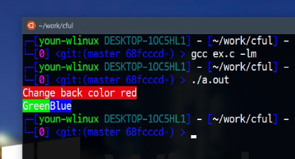

# CFUL-Compact


Colorful console output in C


## Language
  - [한국어](/README.ko.md)
  - [English](/README.md)


## What is CFUL-Compact?
CFUL is functions for colorful console output.
It is support RGB system.


But, CFUL is include many unnecessary functions and macros.


CFUL-Compact is a version that removes unnecessary functions of CFUL.


## Support
  - Linux
  - Windows 10
  - MacOS

If your OS is not support true color, do not use this version


## How to use?
You want this functions, then include only `cful_compact.h` on your project.

```c
#include "cful_compact.h"
```

Set Color

```c
SET_COLOR(type, r, g, b);
```

Type is `FOREGROUND` or `BACKGROUND` define.

```c
#define FOREGROUND  "38"
#define BACKGROUND  "48"
```


Example
```c
#include <stdio.h>
#include "cful-compact.h"

int main ( void )
{
    SET_COLOR(FOREGROUND, 255, 255, 255);

    SET_COLOR(BACKGROUND, 255, 0, 0);
    printf("Change back color red\n");
    
    SET_COLOR(BACKGROUND, 0, 255, 0);
    printf("Green");
    SET_COLOR(BACKGROUND, 0, 0, 255);
    printf("Blue\n");
    
    printf(RESET);
    
    return 0;
}
```


<br><br>
Thanks.
